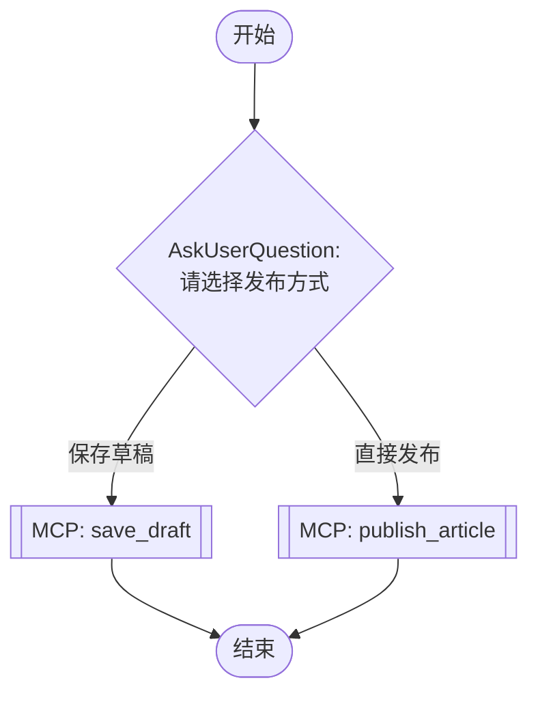

## 工作流执行指南

按照上方的Mermaid流程图执行工作流。每种节点类型的执行方法如下所述。

### 各节点类型的执行方法

- **矩形节点**：使用Task工具执行子代理
- **菱形节点（AskUserQuestion:...）**：使用AskUserQuestion工具提示用户并根据其响应进行分支
- **菱形节点（Branch/Switch:...）**：根据先前处理的结果自动分支（参见详细信息部分）
- **矩形节点（Prompt节点）**：执行下面详细信息部分中描述的提示

## MCP工具节点

#### sf3_save_draft(save_draft)

**描述**: 保存内容到微信草稿箱

**MCP服务器**: wechat-api

**工具名称**: save_draft

**验证状态**: missing

**已配置参数**:

- `account_id` (string): ${account_id}
- `content` (object): ${formatted_article}

**可用参数**:

- `account_id` (string) (必需): 微信公众号ID
- `content` (object) (必需): 文章内容对象

此节点调用MCP（Model Context Protocol）工具。执行此工作流时，请使用已配置的参数通过MCP服务器调用该工具。

#### sf3_publish_now(publish_article)

**描述**: 直接发布到微信公众号

**MCP服务器**: wechat-api

**工具名称**: publish_article

**验证状态**: missing

**已配置参数**:

- `account_id` (string): ${account_id}
- `content` (object): ${formatted_article}

**可用参数**:

- `account_id` (string) (必需): 微信公众号ID
- `content` (object) (必需): 文章内容对象
- `schedule_time` (string) (可选): 发布时间（可选）

此节点调用MCP（Model Context Protocol）工具。执行此工作流时，请使用已配置的参数通过MCP服务器调用该工具。

### AskUserQuestion节点详细信息

#### sf3_publish_option(请选择发布方式)

**选择模式：** 单选（根据所选选项进行分支）

**选项：**
- **保存草稿**: 保存到微信草稿箱，等待后续操作
- **直接发布**: 立即发布到公众号
