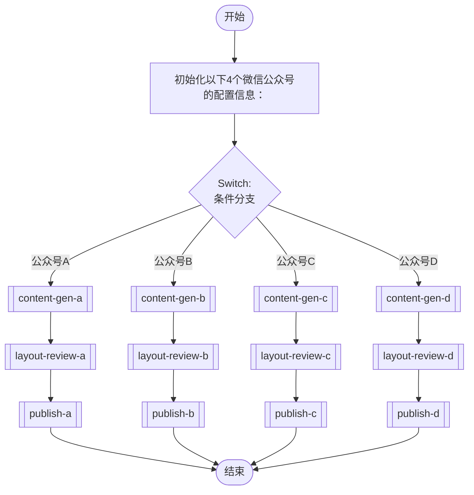

## 工作流执行指南

按照上方的Mermaid流程图执行工作流。每种节点类型的执行方法如下所述。

### 各节点类型的执行方法

- **矩形节点**：使用Task工具执行子代理
- **菱形节点（AskUserQuestion:...）**：使用AskUserQuestion工具提示用户并根据其响应进行分支
- **菱形节点（Branch/Switch:...）**：根据先前处理的结果自动分支（参见详细信息部分）
- **矩形节点（Prompt节点）**：执行下面详细信息部分中描述的提示

## Sub-Agent Flow Nodes

#### content_gen_a(内容生成(A))

@Sub-Agent: wechatgen_

#### content_gen_b(内容生成(B))

@Sub-Agent: wechatgen_

#### content_gen_c(内容生成(C))

@Sub-Agent: wechatgen_

#### content_gen_d(内容生成(D))

@Sub-Agent: wechatgen_

#### layout_review_a(排版审核(A))

@Sub-Agent: wechatgen_

#### layout_review_b(排版审核(B))

@Sub-Agent: wechatgen_

#### layout_review_c(排版审核(C))

@Sub-Agent: wechatgen_

#### layout_review_d(排版审核(D))

@Sub-Agent: wechatgen_

#### publish_a(发布处理(A))

@Sub-Agent: wechatgen_

#### publish_b(发布处理(B))

@Sub-Agent: wechatgen_

#### publish_c(发布处理(C))

@Sub-Agent: wechatgen_

#### publish_d(发布处理(D))

@Sub-Agent: wechatgen_

### Prompt节点详细信息

#### init_accounts(初始化以下4个微信公众号的配置信息：)

```
初始化以下4个微信公众号的配置信息：
1. 公众号A
2. 公众号B
3. 公众号C
4. 公众号D

每个账号包含：账号名称、API密钥、所有者信息
```

### Switch节点详细信息

#### switch_accounts(多分支 (2-N))

**评估目标**: wechat_account

**分支条件：**
- **公众号A**: account_type === 'A'
- **公众号B**: account_type === 'B'
- **公众号C**: account_type === 'C'
- **公众号D**: account_type === 'D'
- **default**: Other cases

**执行方法**：评估先前处理的结果，并根据上述条件自动选择适当的分支。
